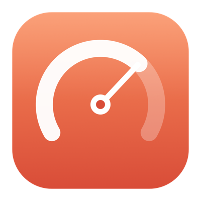
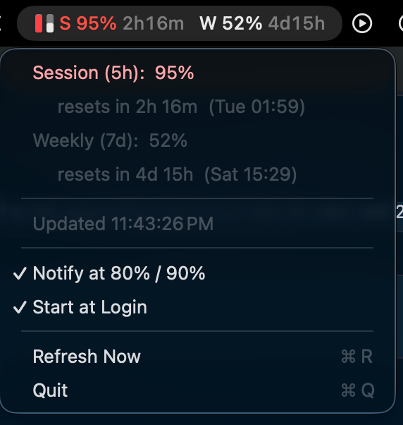

<div align="center">



# ClaudeUsageBar

**A tiny macOS menu-bar app that shows your Claude usage — session & weekly limits — live, at a glance.**

[](https://www.apple.com/macos/)
[](https://swift.org)
[]()
[](LICENSE)

</div>

---

Ever hit your Claude limit mid-flow with no warning? **ClaudeUsageBar** puts a small
live gauge in your menu bar so you always know how much of your **5-hour session**
and **7-day weekly** allowance you've used — the same numbers as Claude Code's
`/usage` panel, without opening a terminal.

<div align="center">

</div>

## ✨ Features

- **Live session + weekly percentages** right in the menu bar.
- **Inline reset countdowns** — each percentage carries its own timer (e.g. `S 91% 2h34m   W 52% 4d16h`), ticking down every minute locally.
- **Gentle on the API** — refreshes utilization every ~5 min, honours `Retry-After`, and backs off automatically if rate-limited (so it never blanks out; it just keeps showing the last reading).
- **Color-coded** — green → 🟠 orange (≥70%) → 🔴 red (≥90%) so a glance is enough.
- **Mini dual-bar gauge** icon (left = session, right = weekly).
- **Threshold notifications** — get pinged when you cross 80%, 90%, or 100%.
- **Reset countdowns** — see exactly when each window rolls over.
- **Start at login** toggle — set it once and forget it.
- **Zero setup, zero secrets** — reuses the login you already did in Claude Code.
- **Native & tiny** — pure Swift + AppKit, no dock icon, no dependencies, no background CPU.

## 🚀 Quick start

**Prerequisites**
- macOS 12 (Monterey) or newer
- [Claude Code](https://claude.com/claude-code) installed **and logged in** (a Pro/Max plan)
- Xcode Command Line Tools — install with `xcode-select --install` if you don't have them

**Install (about 30 seconds)**

```bash
git clone https://github.com/kuchya/ClaudeUsageBar.git
cd ClaudeUsageBar
./build.sh
open ./ClaudeUsageBar.app
```

On first launch macOS asks to access your Keychain item *“Claude Code-credentials”* —
click **Always Allow**. That's it: your session and weekly percentages appear in the
menu bar. 🎉

**Make it permanent (optional)**

```bash
mv ./ClaudeUsageBar.app /Applications/     # keep it in Applications
```

Then open the menu-bar dropdown and tick **Start at Login**.

## 🔍 How it works

ClaudeUsageBar doesn't ask you to log in again and never sees your password. It:

1. Reads the OAuth token that **Claude Code already stored** in your macOS Keychain
   (`Claude Code-credentials`).
2. Calls the same endpoint Claude Code's `/usage` panel uses:
   `GET https://api.anthropic.com/api/oauth/usage`.
3. Parses the `five_hour` (session), `seven_day` (weekly) and `seven_day_opus`
   buckets and shows their `utilization` percentages.

This endpoint **does not consume any of your usage** — checking your meter is free.

## 🔒 Privacy & safety

- **Read-only.** The app never refreshes, rewrites, or transmits your token anywhere
  except directly to Anthropic's own API. It won't touch Claude Code's own auth.
- **No servers, no telemetry, no analytics.** Everything runs locally on your Mac.
- **Open source.** Every line is in this repo — read `Sources/main.swift`.

## 🛠 Troubleshooting

| You see… | Fix |
|---|---|
| `⚠︎ Not signed in` | Log in to Claude Code first (`claude`), then **Refresh Now**. |
| `Token expired` | Run Claude Code once to refresh; the app auto-recovers on the next poll. |
| Repeated Keychain prompts | Click **Always Allow** (not just Allow). Rebuilding the app can re-prompt once. |
| No notifications | Approve ClaudeUsageBar under System Settings → Notifications. |
| `HTTP 4xx` / `Unrecognized payload` | A newer Claude Code changed the endpoint — open an issue. |

## 🎨 Customizing

- **Icon** — edit the design in [`make_icon.swift`](make_icon.swift), then run
  `./make_icon.sh && ./build.sh`.
- **Refresh interval / thresholds / colors** — tweak the `Config` block at the top of
  [`Sources/main.swift`](Sources/main.swift), then `./build.sh`.

## ⚠️ Disclaimer

This is an **unofficial** community project and is **not affiliated with or endorsed by
Anthropic**. It relies on an undocumented internal endpoint that may change or break at
any time. Provided as-is, with no warranty. Use at your own discretion.

## 📄 License

[MIT](LICENSE) — do whatever you like, no warranty.

<div align="center">
<sub>Built with ☕ for people who live in Claude.</sub>
</div>
